# **Abstract**
This work aims to develop a system capable of quickly determining the level of accessibility of a given sidewalk. This system would assist visually impaired individuals with navigating densely obstructed walkways common in major cities, allow for autonomous navigation of dynamically shifting sidewalk environments, and even assist municipalities with sidewalk accessibility monitoring. We utilize the Cityscapes Dataset, a collection of 5k images taken from the dashcam of a car around 50 European cities. Each image is associated with a fine, instanced annotation of 30 classes. We subsampled this dataset to approximately 3k images containing a portion of the visible, segmented sidewalk. We utilized multiple models capable of segmenting these images into component objects, planning further to process the location and identity of the objects to determine the degree of obstruction present in the image.

We explored multiple methodologies to obtain segmentations; MaskRCNN, UNet, SAM (Segment Anything Model), with Random Forest operating as a baseline. The MaskRCNN model was the best choice, as it can produce instanced segmentations while determining the class of the segmented object. The MaskRCNN model is built on FPN and ResNet101 and is pre-trained on the MS COCO dataset, producing instanced segmentations for everyday objects. By adding dense layers for classification, we attempted to train the model to utilize the segmentations to predict observed sidewalk obstruction.

# **Introduction**
The inspiration for this work is Project Sidewalk from The University of Washington. The University of Washington project aims to collect a dataset containing all locations and timestamps for sidewalk obstructions and accessibility items. They plan to utilize this data for machine learning, but their public APIs only provide access to the location information of identified obstacles and objects. We plan to expand upon this idea and create a system capable of automatically determining obstructions present on a sidewalk from simple images or video frames. Our model can be utilized by local municipalities to understand the current condition of city sidewalks and improve them.

To simplify our research, we identified three tasks we must address. The first step was obtaining a segmented sidewalk region within an image. The second was to obtain segmentations of objects which would compose common sidewalk obstructions. The final step was to, utilizing the location and object type, determine the likelihood of each object constituting a suitable obstruction. We utilized Random Forest to obtain sidewalk segmentations from the input image to compare our model to a baseline prediction. We did not compose baseline predictions for total obstruction classification, as this problem is rather complex.

The first segmentation task was relatively easy, as obtaining semantic sidewalk through the use of pre-trained, as well as custom models, was largely successful. We obtained acceptable performance on a simple sidewalk segmentation task utilizing a custom-trained U-Net. When compared to our baseline prediction, this implementation was incredibly successful. Random forest obtained a Dice score of 0.077, while the U-Net obtained a Dice score of .72 on the same validation dataset.

The second segmentation task was slightly more challenging than the initial. We required segmentations for each object in the image that could constitute a sidewalk obstruction. For each object to be processed individually, more than semantic segmentations is required. Instead, we would need to produce instanced segmentations. To accomplish this task, we explored utilizing multiple pre-trained models; MaskRCNN, Yolo, and SAM. Each model successfully obtained the required instanced segmentation from a minimally processed image; however, there were significant compatibility issues with utilizing each one. After significant tinkering, MaskRCNN was the best model to move forward within our specific development environment.

Finally, the obstruction classification was the most challenging aspect of this work. Utilizing the instanced segmentation model, we needed to append additional layers to determine the level of obstruction for each segmented object. To accomplish this, we added dense layers parallel to the class and bounding box determination layers, comparing obstruction prediction to an algorithmically determined ground truth obtained from an augmented dataset.

# **Background**
This project is inspired mainly by Project Sidewalk from The University of Washington. This original project is focused on crowd-sourcing accessibility information for a given city through gamification of the data collection process. Their work was adequate, with human participation obtaining a recall of 63% and a precision of 71% on correctly annotating sidewalk images (Saha et al., 2019). However, this system was optimized to collect locations of obstructions within an image but falls short of obtaining segmentations of objects for further image processing. A completely automated machine learning system could surpass these results and accurately determine sidewalk obstructions via deep learning models.

Recent advances in automatically producing instanced segmentations have made this goal a possibility. New models, such as MaskRCNN (He et al., 2017) and SAM (Segment Anything Model) (Kirillov et al., 2023), can extract objects from images with incredible accuracy. We want to expand upon these models to allow the categorization of segmented objects based on relative location and identity. Utilizing these models as a starting point saves us from training an instanced segmenter from scratch, which is very intensive and demanding. For example, SAM was trained on a dataset of 11 million for either 90k or 180k iterations, depending on desired mask quality (Kirillov et al., 2023), and MaskRCNN on a dataset of 135k images for 90k iterations (He et al., 2017). Leveraging these models provides a solid foundation for instanced segmentation, allowing us to focus on determining how to add classification to the obtained outputs. For example, we could focus on fine-tuning training for obstruction classification instead of training from scratch.

Successful implementation of our proposed model would allow for automated determination of sidewalk obstructions. These obstructions would have a known classifier, size, and location, allowing for information to be shared with the necessary public service to assist in clearing or otherwise managing unexpected obstructions. The data can also be provided to individuals needing accessible routes, enabling them to plan, avoiding reaching impassable obstacles or getting mobility devices stuck and requiring external assistance.

# **Data**
We utilized the CityScapes Dataset for this model (Cordts et al., 2016). This dataset comprises over 5k images collected by dashcam while driving around 50 German cities. This dataset is extensive; however, we only needed a subset of data, notably images containing sidewalks. After isolating and processing the data based on the sidewalk label in the semantic mask, we were left with slightly over 3k samples. Each sample included an image, a semantic segmentation mask for each object class, and a JSON file detailing polygon coordinates and class for each occurrence of an object within the image (instanced segmentation). After extraction, we applied a custom train/test/val split, allocating 10% of the data for validation and testing, with the remaining 80% utilized for training.

To allow for training of the obstruction classifier, we constructed an augmented dataset, algorithmically determining obstructions utilizing intersection over union (IOU) to score the prevalence of the object within the sidewalk boundary. Special attention was paid to cars intersecting with the sidewalk, and any overlap with the street removed it as a possible obstruction, as it is likely the car is simply parked or driving adjacent to the vehicle collecting the images. This dataset includes 115,567 samples, each denoting a single object within an image. ~84k objects were deemed non-obstructions, while the remaining ~32k was established as significant sidewalk obstructions. Images were randomly sampled, and obstructions were visually verified to ensure the dataset was constructed as expected.
The final obstruction dataset contained only 10 out of the 30 classes of the original dataset. From random sampling and manual inspection, we conclude that the classes in the figure below were the most common obstructions a pedestrian could encounter. 

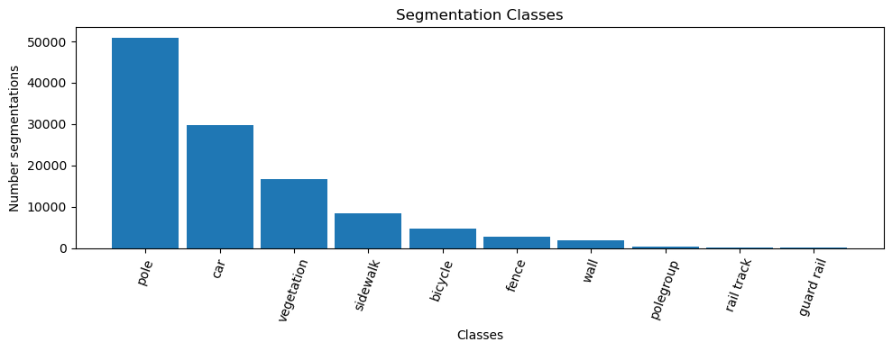

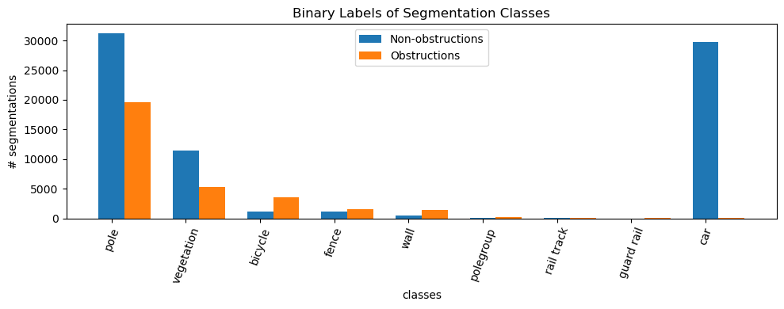

The obstruction dataset contained a class imbalance, with 72% of objects deemed non-obstructions. We attempted to augment our dataset with synthetic data to alleviate this disparity. However, our constructed augmenter only placed a single object on the sidewalk as an obstruction. While this assisted with producing images containing obstructions, it did not help to alleviate the imbalance of object instances. To solve this, we would need to expand the augmenter to place additional objects, which is not feasible given the relatively small size of the sidewalk regions in most images used.

Further processing was performed on these datasets to assist with model exploration and data consistency. First, each class's semantic mask was extracted and saved separately, assisting with training traditional semantic masking techniques (i.e., Unet). To minimize data complexity and training overhead, the images, respective mask images, and JSON polygon coordinates were downsampled from 2048x1024 to 512x216.

# **Methods**
## Baseline
We have generated a set of 23 image features for each image using techniques such as thresholding, edge detection, blurring, smoothing, and image filters. We utilized random forests feature importance to extract 10 features out of 23 features.

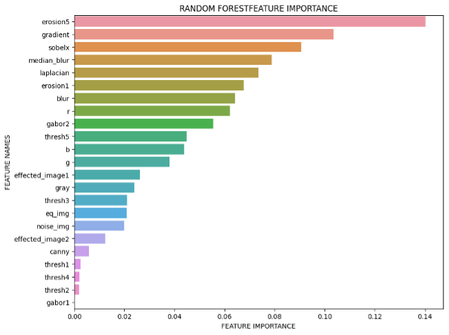

We utilized GridSearchCV to tune random forest hyperparameters. Model starts to overfit when n_estimators> 2000 and max_depth is >5. Best parameters for our modes are n_estimators=2000, criterion=entropy, max_depth=4 , min_samples_leaf=1 .

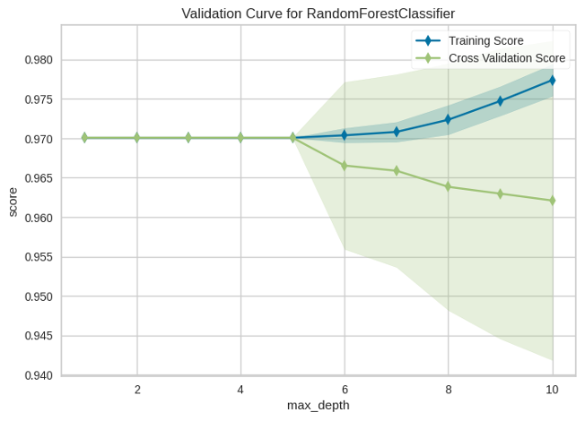

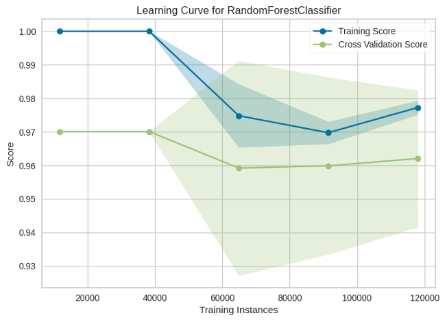

## Sidewalk Segmentation
Our first goal was to produce a network capable of automatically constructing semantic segmentations of sidewalk areas. We utilized a simple U-Net architecture containing four down-convolution and four up-convolution blocks for a total of 12 convolutional layers. We compared this task directly to a baseline model, Random Forest.  

This task was the simplest of our goals, and producing semantic segmentation is relatively straightforward, given we are utilizing the correct architecture. The U-net was trained for 100 epochs, with an early stop scheduled for when the model fails to improve throughout 15 epochs.  At that point, the best-performing model on the validation data was preserved and analyzed for performance.  Due to this being a precursor for object segmentation, whereas trained convolutional filters may be of use, we decided not to expose this model to the test dataset.  The model was trained utilizing 1-dice as the loss function.

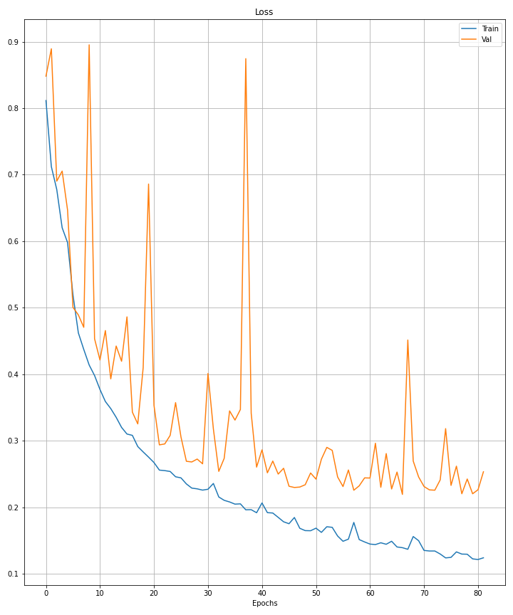

## Object Segmentation
The object segmentation task was much more complex.  Initially, we looked into upgrading the U-Net architecture to produce multi-class semantic segmentations. However, we quickly realized that instanced segmentations are required to classify individual objects as obstructions.  U-Nets cannot produce a variable number of instanced segmentations; therefore, we started exploring alternative models.

Due to the complexity and a large amount of training required to compute a variable number of instanced segmentations, we obtained multiple pre-trained models as starting points.  We explored utilizing MaskRCNN and SAM.  Each model was significantly more complex than the U-Net and required significant tinkering and probing to understand and utilize within the TensorFlow environment. MaskRCNN was originally constructed for TensorFlow 1.* we worked to convert all necessary components to ensure compatibility with TensorFlow 2.*.  SAM was written utilizing PyTorch, which required conversion to TensorFlow to augment the architecture to the intended extent.  We successfully converted it into Onnx but could not further process it into TensorFlow, as some of the required nodes had no TensorFlow equivalents.

To progress in the proposed direction, we abandoned the conversion of SAM, instead working exclusively on MaskRCNN.  The researchers who trained and analyzed MaskRCNN utilized the CityScapes dataset to demonstrate segmentation performance, significantly outperforming other commonly used instanced segmentation models. We were confident in the ability of the model to accurately utilize our data, working exclusively on augmenting the model for our next task.

## Obstruction Classification
Properly classifying sidewalk obstructions is the most complex portion of this project.  We intended to modify MaskRCNN architecture by adding a classification fork, utilizing a fully connected network to predict the probability of each object constituting a significant obstruction to the walkway.  Although the architecture was incredibly complex, it was constructed from multiple distinguishable regions, each performing a portion of the required processing.

For example, the main portions of the MaskRCNN structure we are interested in are; the region proposal network, classification network, bounding box network, and mask generation network.  The region proposal network modulates the network’s attention to certain input image regions.  The further networks process those extracted regions to produce useful outputs. Our network augmentation was parallel to the dense networks responsible for the class determination and bounding box generation.

This process was rather complex as model training performance needed to be finetuned to make up for class imbalances, but also, the architecture required refinement to ensure proper learning without purely memorizing the training data.  To this end, we explored multiple options for the loss function and the number and size of dense layers in the obstruction classification section.  We utilized Focal Binary Cross Entropy (Lin et al., 2017), Weighted Binary Cross Entropy, and Binary Cross Entropy for obstruction loss functions.  We explored dense layers ranging from 2 layers with 11 and 1 nodes to 4 layers with 64, 32, 16, and 1 nodes.  Due to the long time required for training, not all attempts completed a full 20 epochs (~12 hours).  For consistency of evaluation, we limit our analysis to models that completed a full 20-epoch training session.

The first model which we will call ‘Simple_Dense’ that  we choose to evaluate follows the structure of the MaskRCNN classifier head. This model has one Dense layer with two nodes - for classifying 0: non-obstructions and 1: obstructions. We call this portion of the network the obstruction head. As the classifier head calculates the loss using the categorical cross entropy, the obstruction head utilizes binary cross entropy to propagate its losses. We expanded upon this model, adding additional complexity through three additional dense layers.  All four dense layers had the following number of nodes: 64, 32, 16, and 1.  We expected for this initial expanded model to overtrain significantly, which would inform us the task is obtaininable, and the network could be simplified to increase validation performance.

# **Evaluation**
Deep learning models can quickly achieve a very good result in the field of image segmentation, object detection and image classification using GPU. An alternative way to achieve a good result without GPU is random forest, since it is known to perform great with large datasets like images.  For our baseline model we have trained 3 models for image segmentation, object classification and obstruction classification.  After a lot of preprocessing and hyper tuning our model, it achieved a very low dice score for segmentation.  Our baseline segmentation model achieved a 7.7% dice score with 17% precision and only 5% recall rate.

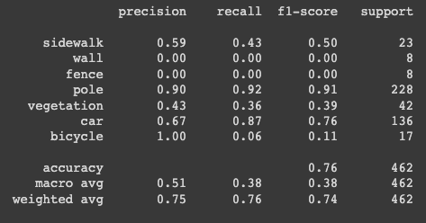

Our object classification model has an accuracy of 76% across all classes. Given that our data is very imbalanced, model was unable to detect any instances of wall or fence.  However, it did very well classifying sidewalk, vegetation, car, and pole. When it comes to bicycles, model did extremely well not labeling other classes as bicycles, however it miss-classified most of the bicycles which can be seen by recall rate of only 6%.

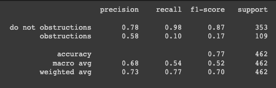

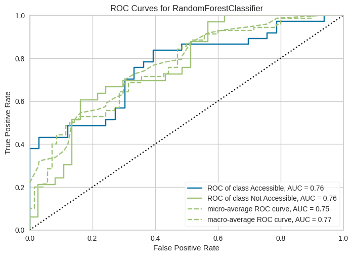

Our modified MaskRCNN generates multiple outputs for each instance, the predicted bounding boxes, masks, class ids, class confidence, obstruction label, obstruction confidence. This creates a challenge to evaluate the performance of the model, leaving us to combine object detection metrics and semantic segmentation metric in hopes of giving us a comprehensive insight to how the model is performing. As explained in the above ‘Method’ section, we had made various changes to the network for the purpose of detecting and segmenting multi-label and multi-class instances. In this section, we will present the performance of models that has achieved training of 20 epochs.

The initial challenge is matching the predictions to their ground truth labels. We do this by calculating the IoUs of all the instances of masks and instances of ground truth with one another. If the IoUs are above a certain threshold, we accept the pair as a candidate groundtruth, prediction pair. However, ultimately the ground truth label will be matched to the prediction with the highest IoU. 
## DICE-Coefficient
Instance and semantic segmentations has become a popular research field which builds upon the object classification and detection tasks. The DICE coefficient is a statistical measure used to calculate the similarity and overlap of two binary objects. However, the metric does not take into account the class labels but rather just the binary masks itself.
$$\text{Dice coefficient} = \frac{{2 \times \text{intersection}}}{{\text{sum of set A} + \text{sum of set B}}}$$

This is perfectly suited to check how well our model is doing on the mask generation task. As described above, the ground truth and prediction pair that have the highest IoU are chosen and their DICE coefficient calculated. The performance of the entire test dataset is summarized below. Each column has a different IoU threshold to filter labels and predictions pairs:

|          |IOU@0.1                 | IOU@0.25                  | IOU@0.5                 | IOU@0.7                  |
|----------|--------------------------|--------------------------|--------------------------|--------------------------|
| Simple_Dense | 	 0.08048      |  0.07890      | 0.02687     | 0.00878     |
| Model 2 |        0.03794           | 0.031854      |    0.009727           |                 0.0        |

As predicted for both models, the higher the IoU threshold, the smaller the score becomes as the threshold filters out the majority of low IoU labels. Simple_Dense however, performed slightly better.
## Precision/Recall
Precision and Recall is one of the most commonly used metrics for classification tasks. Since our project hopes to detect both binary and multi-class objects, we decided that we will also be using these metrics to evaluate and compare the performance between our models. Similarly to the DICE metric, we evaluate the detection with the matched ground truth bounding box to the predicted bounding box of the same threshold range $(0.1,0.25,0.5,0.7)$. 

  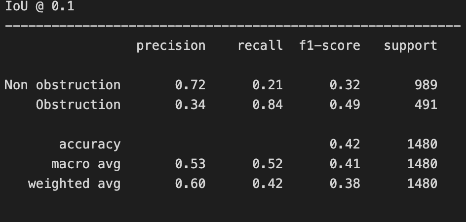
&nbsp; &nbsp; &nbsp; &nbsp;
  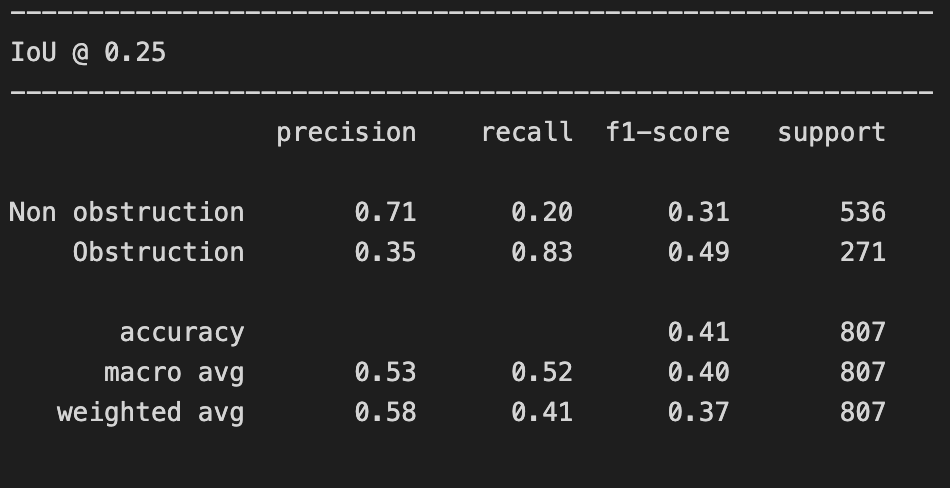

  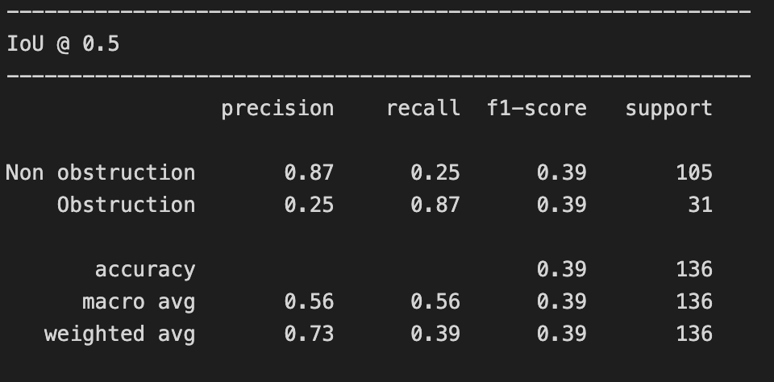
&nbsp; &nbsp; &nbsp; &nbsp;
  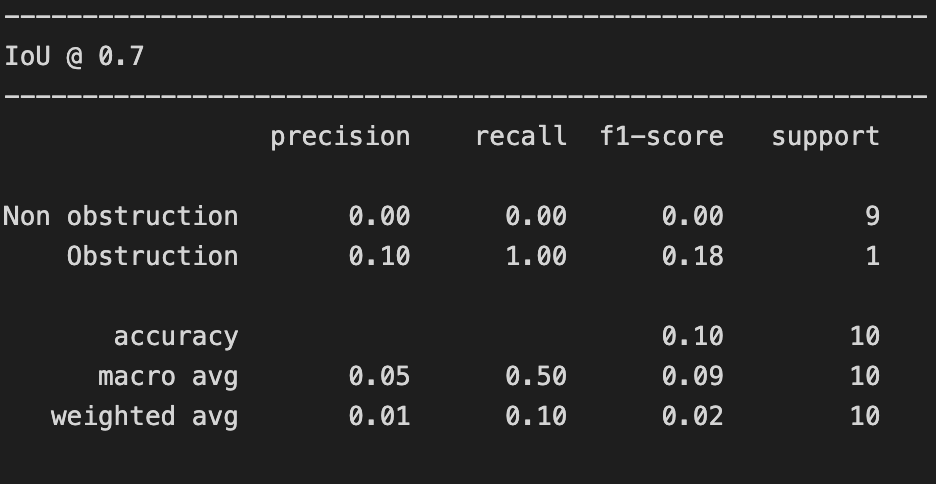

Perhaps due to the nature of the imbalanced multi-class data, the network was only able to detect the six of the ten labels even at the lowest IoU threshold, this can be shown in the classification report below. 

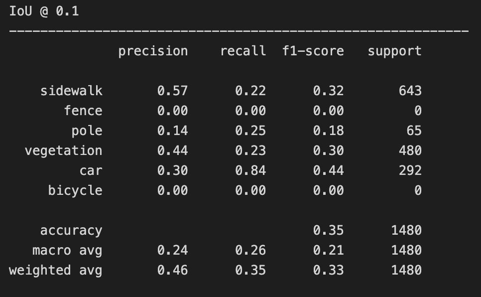

# **References**
Cordts, M., Omran, M., Ramos, S., Rehfeld, T., Enzweiler, M., Benenson, R., Franke, U., Roth, S., &amp; Schiele, B. (2016). The cityscapes dataset for Semantic Urban Scene understanding. 2016 IEEE Conference on Computer Vision and Pattern Recognition (CVPR). https://doi.org/10.1109/cvpr.2016.350 

He, K., Gkioxari, G., Dollar, P., &amp; Girshick, R. (2017). Mask R-CNN. 2017 IEEE International Conference on Computer Vision (ICCV). https://doi.org/10.1109/iccv.2017.322 

Kirillov, A., Mintun, E., Ravi, N., Mao, H., Rolland, C., Gustafson, L., Xiao, T., Whitehead, S., Berg, A. C., Lo, W.-Y., Dollár, P., & Girshick, R. (2023). Segment Anything. ArXiv:2304.02643.

Lin, T.-Y., Goyal, P., Girshick, R., He, K., & Dollar, P. (2017). Focal loss for dense object detection. 2017 IEEE International Conference on Computer Vision (ICCV). https://doi.org/10.1109/iccv.2017.324 

Saha, M., Saugstad, M., Maddali, H. T., Zeng, A., Holland, R., Bower, S., Dash, A., Chen, S., Li, A., Hara, K., &amp; Froehlich, J. (2019). Project sidewalk. Proceedings of the 2019 CHI Conference on Human Factors in Computing Systems. https://doi.org/10.1145/3290605.3300292 

